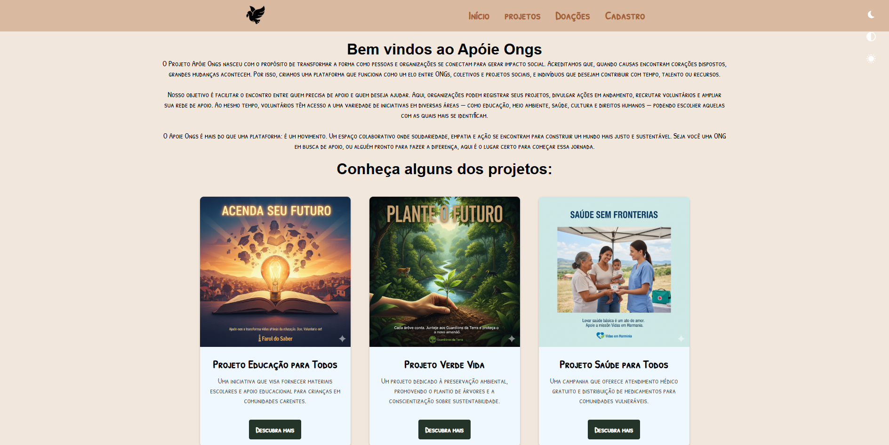
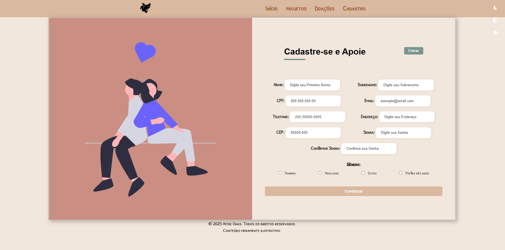

# 🐾 Apoie ONGs

Um site criado para **conectar pessoas e instituições que desejam apoiar causas sociais**, facilitando o cadastro de voluntários, o acesso a projetos e a realização de doações.  

O projeto foi desenvolvido como parte de uma **atividade acadêmica**, aplicando conceitos de **HTML, CSS e JavaScript**, com foco em **acessibilidade**, **responsividade**, **temas personalizados** e **SPA (Single Page Application)**.

---

## 📸 **Prévia do Projeto**

### 🏠 Página Inicial


### 🧾 Página de Cadastro


---

## 🚀 **Funcionalidades Principais**

✅ **Navegação SPA (Single Page Application)**  
- As páginas internas são carregadas dinamicamente via JavaScript, sem recarregar o site.

✅ **Menu Responsivo (Hamburger Menu)**  
- Menu adaptável para telas menores, com transição suave de abertura e fechamento.

✅ **Temas de Acessibilidade**  
- 🌙 **Modo Escuro**  
- 🌗 **Modo Alto Contraste**  
- ☀️ **Tema Padrão (Reset)**  
> As preferências de tema são armazenadas no `localStorage`, garantindo persistência ao recarregar a página.

✅ **Formulário Interativo de Cadastro**
- Máscaras automáticas para:
  - CPF → `000.000.000-00`
  - Telefone → `(00) 00000-0000`
  - CEP → `00000-000`
- Validação de CPF com alerta central visual e animação suave.
- Estrutura organizada com campos obrigatórios, foco de acessibilidade e layout limpo.

✅ **Design Responsivo e Moderno**
- Interface adaptada para **desktop, tablet e celular**.  
- Estrutura em **flexbox** e **grid**, com uso de **ícones SVG** e **contrastes acessíveis**.

---

## 🧠 **Tecnologias Utilizadas**

- **HTML5** → Estrutura e semântica das páginas  
- **CSS3** → Layout responsivo e estilização visual  
- **JavaScript (ES6+)** → Navegação SPA, máscaras e validações  
- **LocalStorage** → Armazenamento de tema selecionado  
- **SVG** → Ícones vetoriais otimizados  

---

## ⚙️ **Como Executar o Projeto**

Clone o repositório e abra o arquivo `index.html` no navegador:

```bash
git clone https://github.com/Naubo/Apoie_Ongs.git
